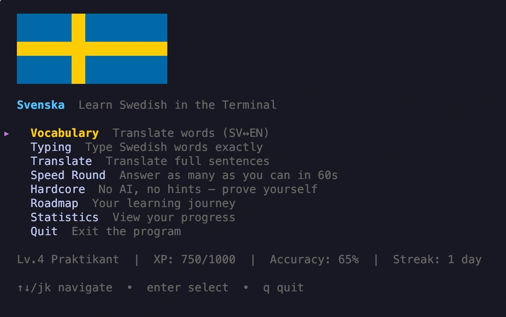
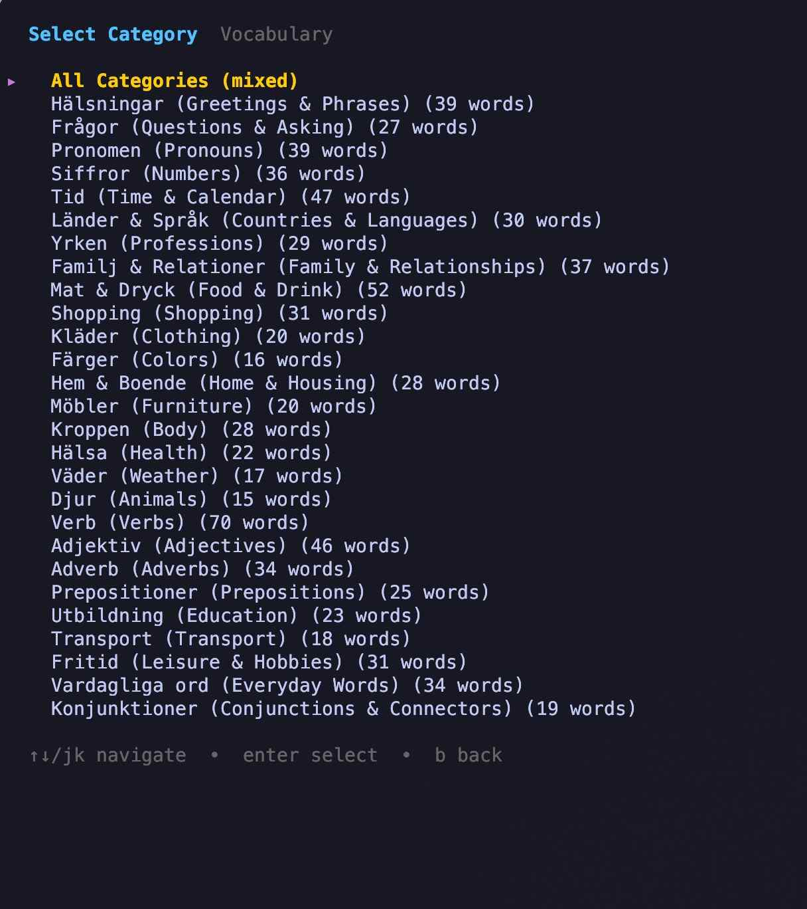
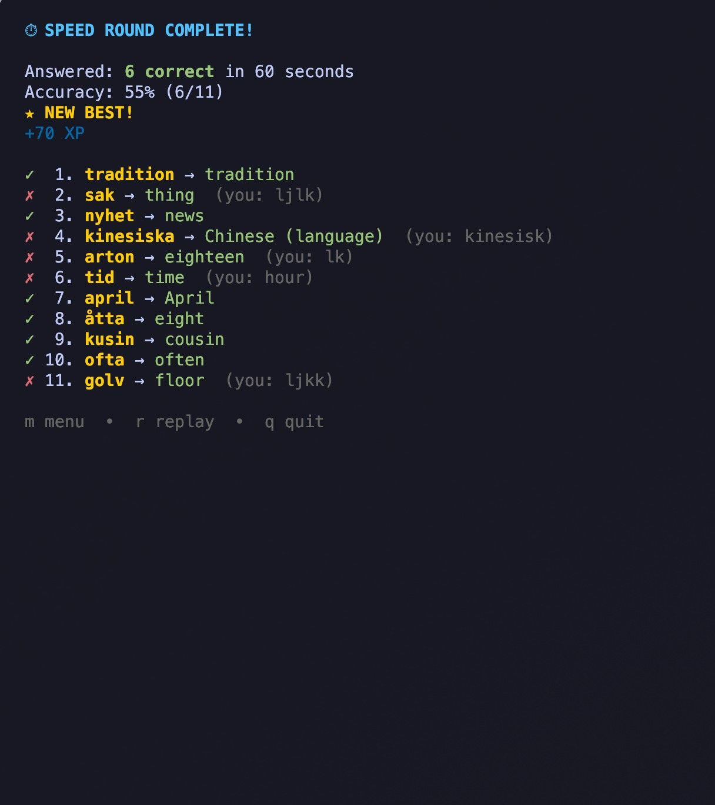
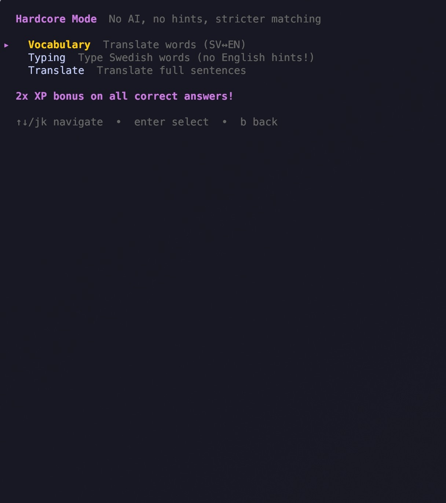
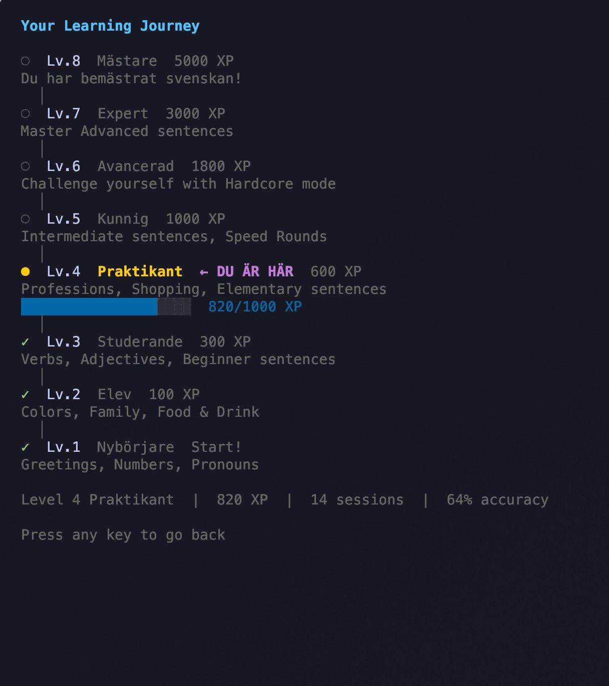
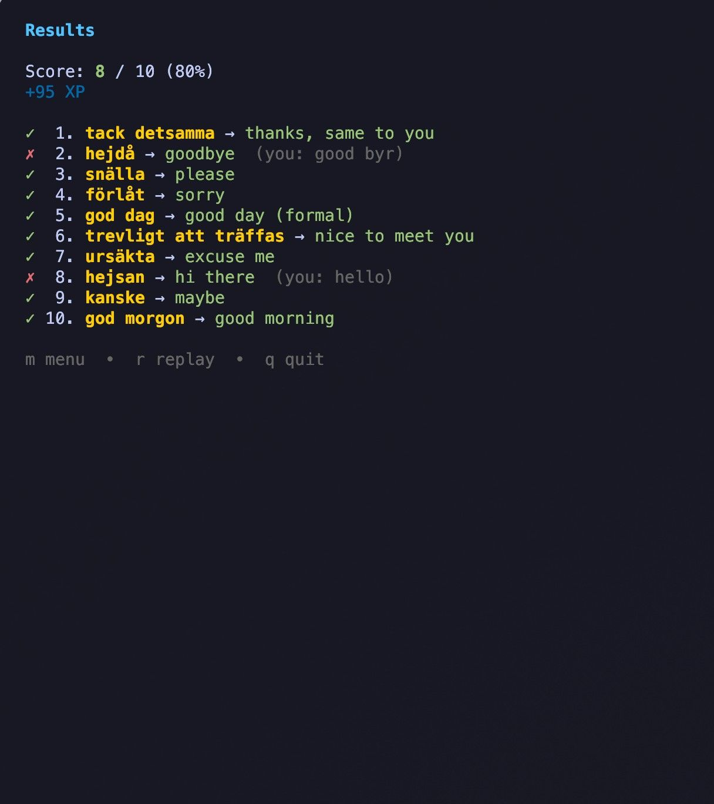
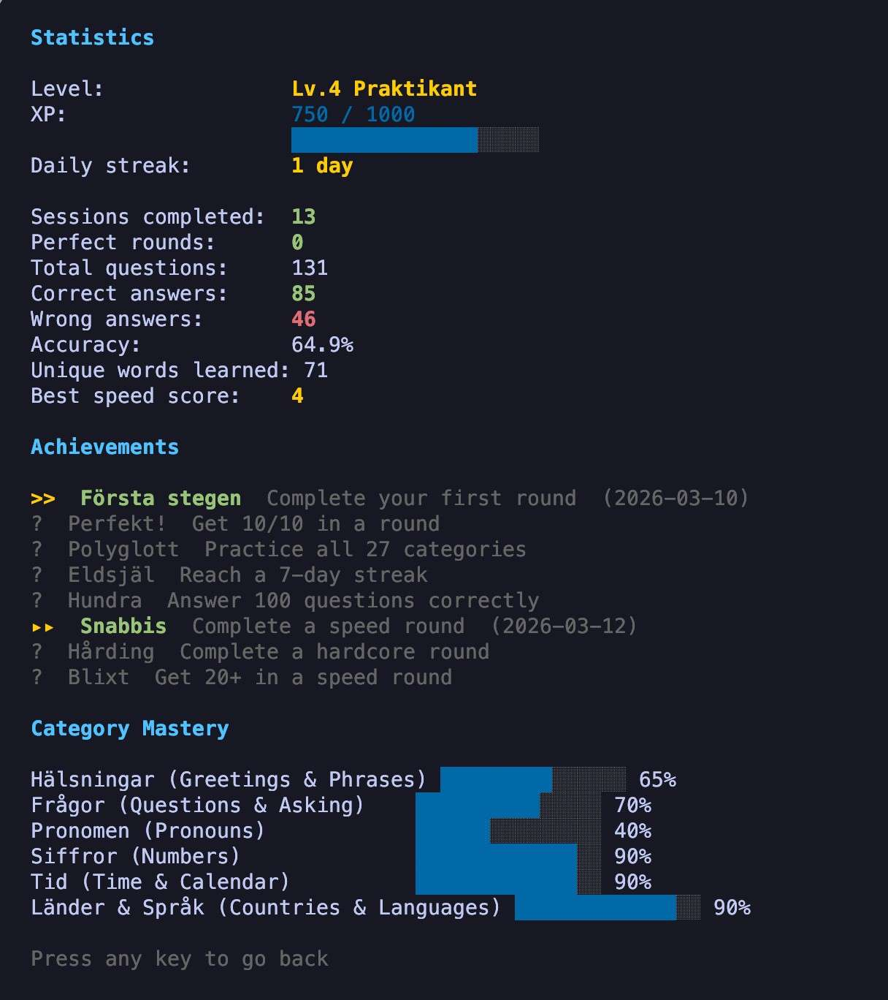

# Svenska

A terminal app for practicing Swedish (A1-A2 level), built with Go and [Bubble Tea](https://github.com/charmbracelet/bubbletea).



## Features

- **Vocabulary** — Translate words between Swedish and English
- **Typing** — Type Swedish words exactly as shown
- **Translate** — Translate full sentences (SV↔EN)
- **Speed Round** — Answer as many questions as you can in 60 seconds
- **Hardcore Mode** — No AI, no hints, stricter matching — 2x XP
- **Roadmap** — Visual learning journey from Nyborjare to Mastare
- **AI Help** — Type `?` during any challenge to get an AI-powered explanation
- **Gamification** — XP, levels, daily streaks, and achievements
- **Statistics** — Track your progress, category mastery, and achievements across sessions
- **Flexible matching** — Accepts partial answers, strips parentheticals, splits alternatives on `/`
- 27 word categories and 4 sentence difficulty levels

## Screenshots

| | |
|---|---|
|  |  |
| Vocabulary — translate words | Speed Round — 60s timed challenge |
|  |  |
| Hardcore — no AI, no hints, 2x XP | Roadmap — your learning journey |
|  |  |
| Results — round summary | Statistics — track your progress |

## Install

```bash
curl -sSL https://raw.githubusercontent.com/crisecheverria/svenska/main/install.sh | sh
```

Works on macOS and Linux (amd64/arm64). No Go required.

To update later:

```bash
svenska update
```

## Usage

```bash
svenska
```

Navigate with `↑↓` or `j/k`, select with `enter`, go back with `b` or `esc`.

During a challenge, type `?` and press enter to get AI help with the current word or sentence.

## Game Modes

### Vocabulary / Typing / Translate

The classic modes — practice words or sentences at your own pace with 10 questions per round.

### Speed Round

Race against the clock! You have 60 seconds to answer as many vocabulary questions as possible. No feedback between questions — just keep going. Track your best score and compete with yourself.

### Hardcore Mode

Prove your Swedish knowledge the hard way:
- No AI help (`?` is disabled)
- No English hints in Typing mode
- Stricter answer matching (exact answers only, no alternatives)
- **2x XP** on all correct answers

## AI Help

AI help uses **free models** via [OpenRouter](https://openrouter.ai/) — no API key or account needed. Just type `?` during any challenge.

> **Note:** AI-generated explanations are not perfect and may contain mistakes. Use them as a helpful guide, not as a definitive source. When in doubt, verify with a textbook or native speaker.

Models used (with automatic fallback):
- Primary: `arcee-ai/trinity-large-preview:free`
- Fallback: `nvidia/nemotron-3-nano-30b-a3b:free`

For higher rate limits, you can optionally set an OpenRouter API key (Recommended):

```bash
export OPENROUTER_API_KEY="sk-or-..."
```

Add it to your shell config (`~/.zshrc` or `~/.bashrc`) to persist across sessions.

## Roadmap & Levels

Your learning journey has 8 levels, each with recommended activities:

| Level | Name | XP | Focus |
|-------|------|-----|-------|
| 1 | Nyborjare | 0 | Greetings, Numbers, Pronouns |
| 2 | Elev | 100 | Colors, Family, Food & Drink |
| 3 | Studerande | 300 | Verbs, Adjectives, Beginner sentences |
| 4 | Praktikant | 600 | Professions, Shopping, Elementary sentences |
| 5 | Kunnig | 1,000 | Intermediate sentences, Speed Rounds |
| 6 | Avancerad | 1,800 | Challenge yourself with Hardcore mode |
| 7 | Expert | 3,000 | Master Advanced sentences |
| 8 | Mastare | 5,000 | Du har bemastrat svenskan! |

## Gamification

- **XP & Levels** — Earn 10 XP per correct answer, bonus for streaks and perfect rounds
- **Hardcore Bonus** — 2x XP for all Hardcore mode answers
- **Daily Streak** — Play every day to build your streak
- **Achievements** — Unlock badges like Forsta stegen, Perfekt!, Snabbis, Harding, and more
- **Category Mastery** — Track accuracy per category
- **Speed Records** — Track your best speed round score

## Data

- Greetings, pronouns, numbers, time, countries, professions, family, food, shopping, clothing, colors, home, furniture, body, health, weather, animals, verbs, adjectives, adverbs, prepositions, education, transport, leisure, everyday words, and conjunctions
- 4 sentence levels: Beginner (A1), Elementary (A1-A2), Intermediate (A2), Advanced (A2+)

## Stats

Your progress is saved to `~/.local/share/svenska/stats.json` and persists across sessions.
